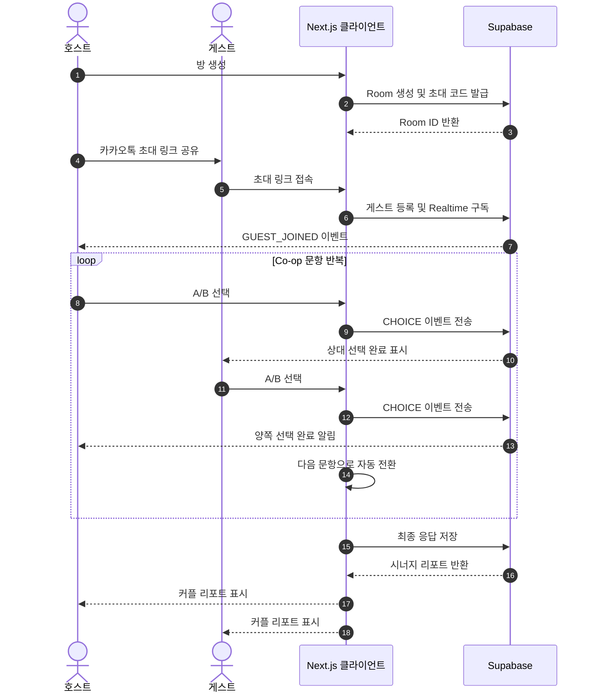
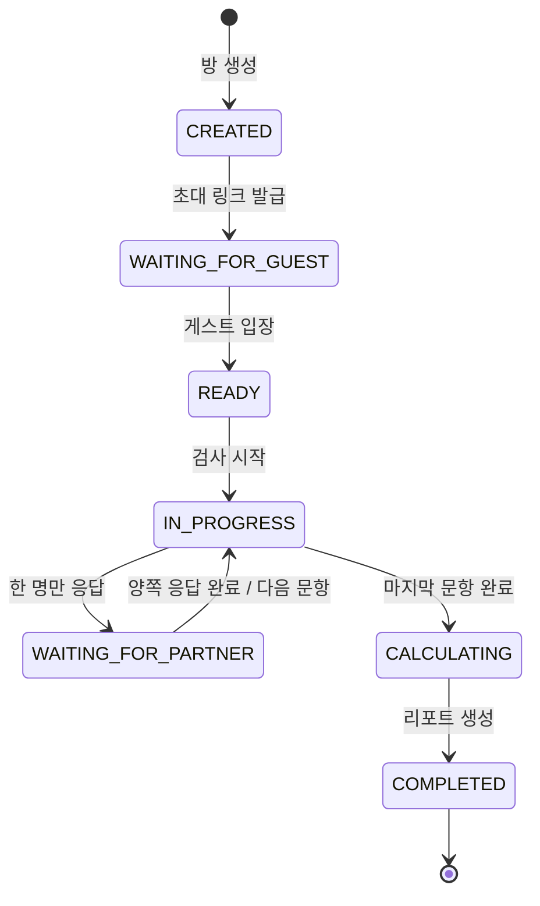

# 쿵짝랩 (KungJjak Lab)

> 혼자서도, 둘이서도 착착 맞는 커플 성향 탐구소

쿵짝랩은 짧은 MBTI 검사와 커플용 실시간 협동 콘텐츠를 결합한 모바일 퍼스트 웹 서비스입니다. 사용자는 혼자 자신의 성향을 확인하거나, 연인을 초대해 같은 상황에 답하고 두 사람의 호흡과 갈등 포인트를 리포트로 확인할 수 있습니다.

이 저장소는 쿵짝랩의 Phase 1 구현 프로젝트입니다. Next.js App Router, Supabase, Tailwind CSS를 기반으로 Solo 검사와 2인 실시간 Co-op 경험을 우선 개발합니다.

## 제품 목표

- 긴 일회성 검사 대신 짧고 반복 가능한 성향 콘텐츠를 제공한다.
- 두 사용자가 동시에 참여하는 경험으로 자연스러운 대화와 공감대를 만든다.
- 결과 카드, 판결문, 시너지 리포트처럼 공유하고 다시 방문할 이유가 있는 산출물을 만든다.
- 개발 용어 없이 누구나 모바일에서 바로 이해할 수 있는 인터페이스를 제공한다.

## 주요 사용자

- 20~30대 커플
- 한 명은 디지털 서비스에 익숙하지만 다른 한 명은 그렇지 않을 수 있음
- 메신저 초대 링크만으로 별도 설명 없이 함께 참여하길 원하는 사용자

## 핵심 콘텐츠

### 1. 일반 MBTI 검사 (Solo Mode)

- E/I, S/N, T/F, J/P 각 3문항, 총 12문항
- 좌우 스와이프 또는 A/B 버튼으로 답변
- 성향별 퍼센티지 스펙트럼과 3D 아이콘 제공
- 연인에게 보여 줄 행동 가이드와 공유용 결과 제공

### 2. 연애 재판소 (Courtroom Mode)

- `T vs F 감정 판결`, `S vs N 상상 판결`, `P vs J 계획 판결` 카테고리
- 두 사람이 독립적으로 선택한 뒤 합의 결과 생성
- 원고/피고, 사건 개요, 판결 요지, 합의 서약서를 포함한 최종 판결문
- 실제 갈등 사연을 제보하고 다른 커플이 투표하는 열린 재판소로 확장

### 3. MBTI 멀티버스 (Co-op Realtime Mode)

- 호스트가 방을 만들고 4자리 코드 또는 카카오톡 링크로 게스트 초대
- 게스트 입장 및 준비 상태를 Supabase Realtime으로 동기화
- 같은 상황에 각자 답하고 상대가 답했는지만 실시간 표시
- 양쪽 답변이 모두 도착하면 다음 문항으로 자동 전환
- 최종 쿵짝 스코어와 갈등 방지 가이드 생성

## 핵심 사용자 흐름



### Co-op 세션 상태



## MVP 범위

초기 릴리스는 반복 방문 기능보다 핵심 협동 경험 검증에 집중합니다.

### 포함

- 랜딩 및 콘텐츠 선택
- Solo 12문항 검사와 결과 리포트
- Co-op 방 생성, 4자리 코드, 초대 링크
- 2인 입장 및 문항별 실시간 응답 동기화
- 쿵짝 스코어와 기본 갈등 방지 가이드
- 모바일 반응형 UI와 공유용 메타데이터

### 후속 릴리스

- 연애 재판소 전체 플로우
- 열린 재판소 UGC, 투표, 신고 및 운영 도구
- 동적 OG 이미지와 결과 이미지 저장
- Google AdSense 및 Coupang Partners 연동
- 회원 계정, 히스토리, 재방문 개인화

## 기술 방향

| 영역 | 선택 | 용도 |
| --- | --- | --- |
| 프론트엔드 | Next.js App Router + TypeScript | 모바일 웹, 서버 렌더링, 동적 메타데이터 |
| 스타일 | Tailwind CSS | 반응형 UI와 디자인 토큰 |
| 모션 | Framer Motion | 카드 스와이프와 화면 전환 |
| 데이터 | Supabase Postgres | 방, 참여자, 문항, 응답, 리포트 저장 |
| 실시간 | Supabase Realtime | 입장, 준비, 선택 완료 상태 동기화 |
| 공유 | `next/og` (Satori) | 카카오톡·SNS용 결과 이미지 |

브로드캐스트는 즉각적인 UI 피드백에 사용하고, 최종 응답과 세션 상태는 Postgres에 영속화합니다. 점수 계산과 리포트 확정은 클라이언트 입력을 그대로 신뢰하지 않고 서버 측에서 처리합니다.

### 확정된 Phase 1 규칙

- Solo와 Co-op 모두 E/I, S/N, T/F, J/P 각 3개씩 총 12문항을 사용합니다.
- 쿵짝 스코어는 `(두 사용자의 선택이 일치한 문항 수 / 12) × 100`으로 계산합니다.
- 로그인 화면 없이 Supabase Anonymous Auth로 비회원 세션을 만들고 `auth.uid()`를 권한 기준으로 사용합니다.
- 진행 중에는 상대방의 선택 완료 여부만 전송합니다. 실제 A/B 선택은 양쪽 제출 완료 후에만 상대에게 공개합니다.
- 연애 재판소와 UGC는 Phase 2 범위이며 Phase 1 랜딩에서는 Coming Soon으로만 노출합니다.

## 초기 데이터 모델

| 엔터티 | 주요 필드 | 설명 |
| --- | --- | --- |
| `rooms` | `id`, `code`, `mode`, `status`, `host_id`, `expires_at` | 2인 세션과 수명 주기 |
| `participants` | `id`, `room_id`, `role`, `joined_at`, `ready_at` | 호스트·게스트 참여 정보 |
| `questions` | `id`, `mode`, `dimension`, `prompt`, `position` | 모드별 문항 |
| `choices` | `id`, `question_id`, `label`, `score` | A/B 선택지와 점수 규칙 |
| `responses` | `room_id`, `participant_id`, `question_id`, `choice_id` | 중복 방지를 포함한 응답 원장 |
| `reports` | `room_id`, `score`, `summary`, `guide`, `created_at` | 확정된 결과 스냅샷 |

실제 스키마에서는 익명 참여자 토큰, RLS 정책, 응답의 `(room_id, participant_id, question_id)` 유일성, 만료된 방 정리 정책이 필요합니다.

## 실시간 이벤트 초안

| 이벤트 | 발생 시점 | 최소 payload |
| --- | --- | --- |
| `GUEST_JOINED` | 게스트가 방에 등록됨 | `roomId`, `participantId` |
| `READY_CHANGED` | 참여자의 준비 상태 변경 | `roomId`, `participantId`, `ready` |
| `CHOICE_SUBMITTED` | 한 명이 현재 문항에 응답 | `roomId`, `questionId`, `participantId` |
| `QUESTION_COMPLETED` | 양쪽 응답 저장 완료 | `roomId`, `questionId`, `nextQuestionId` |
| `REPORT_READY` | 서버가 리포트 확정 | `roomId`, `reportId` |

상대방의 실제 선택값은 두 사람의 응답이 모두 확정되기 전까지 공개하지 않습니다. 모든 이벤트에는 방 권한 검증과 중복 전송에 안전한 처리가 필요합니다.

## 디자인 원칙

- 콘셉트: Neubrutalism + 3D Kitsch
- 배경: 따뜻한 아이보리 `#FFF8F0`
- 포인트: 핑크 `#FF9EAA`, 블루 `#A0E9FF`, 옐로 `#FFD966`, 민트 `#C1ECE4`
- 형태: 3px 검은 테두리, 4~6px 하드 섀도, 둥근 카드
- 타이포그래피: LINE Seed KR
- 그래픽: 성향과 결과를 표현하는 3D 오브젝트
- UX: 엄지손가락 범위의 큰 선택 버튼, 한 화면 한 행동, 상태를 색상뿐 아니라 문구로도 안내

## 비기능 요구사항

- Mobile First Responsive Web, 앱 래핑을 고려한 구조
- 초대 링크 접속 후 최소 단계로 참여 가능
- 네트워크 재연결 시 현재 문항과 응답 상태 복구
- 새로고침·중복 클릭·이벤트 재전송에도 응답이 중복 저장되지 않음
- 방 코드 추측, 다른 방 데이터 조회, 결과 조작을 막는 RLS와 서버 검증
- 기본 SEO, 접근성, 성능 지표와 개인정보 최소 수집 원칙 준수

## 환경 변수 초안

```bash
NEXT_PUBLIC_SUPABASE_URL=
NEXT_PUBLIC_SUPABASE_ANON_KEY=
SUPABASE_SERVICE_ROLE_KEY=
NEXT_PUBLIC_SITE_URL=http://localhost:3000
```

`SUPABASE_SERVICE_ROLE_KEY`는 서버 전용이며 브라우저 번들에 포함하면 안 됩니다. 실제 개발 시작 시 `.env.example`을 추가하고 비밀값은 커밋하지 않습니다.

## 구현 로드맵

1. Next.js 프로젝트와 디자인 토큰 구성
2. 문항·선택지 스키마 및 Solo 검사 구현
3. Supabase 로컬/개발 환경, RLS, 방 생성 API 구현
4. Co-op 대기실과 Realtime 상태 머신 구현
5. 응답 저장, 점수 계산, 결과 리포트 구현
6. 모바일·재연결·동시성·접근성 테스트
7. 공유용 OG 이미지, 분석 도구, 배포 구성

## 후속 결정이 필요한 항목

- 방 만료 시간, 재입장 정책, 호스트 이탈 시 처리
- 카카오 SDK 기반 공유와 일반 Web Share API의 적용 범위
- 사용자 제보 콘텐츠의 검수, 신고, 삭제 정책

## 참고 산출물

- [제품 요구사항 v2](docs/product/product-requirements-v2.pdf): 서비스 정의, 벤치마킹, 기능 명세, 수익화 및 SEO 방향
- [Co-op 시퀀스 다이어그램](docs/architecture/co-op-sequence.png): 2인 방 생성부터 리포트 출력까지의 실시간 흐름
- [Co-op Mermaid 원본](docs/architecture/co-op-sequence.mmd): 시퀀스 다이어그램의 편집 가능한 소스
- [디자인 시스템](docs/design/design-system.md): 콘셉트, 컬러, 타이포그래피, Tailwind 토큰 가이드

## 작업 일지

코드 변경사항은 커밋 메시지처럼 간결하게 [날짜별 작업 일지](docs/작업일지/)에 기록합니다.

## 라이선스

미정. 외부 공개 전 코드 라이선스와 LINE Seed KR, 3D 그래픽 에셋의 사용 조건을 최종 확인해야 합니다.
